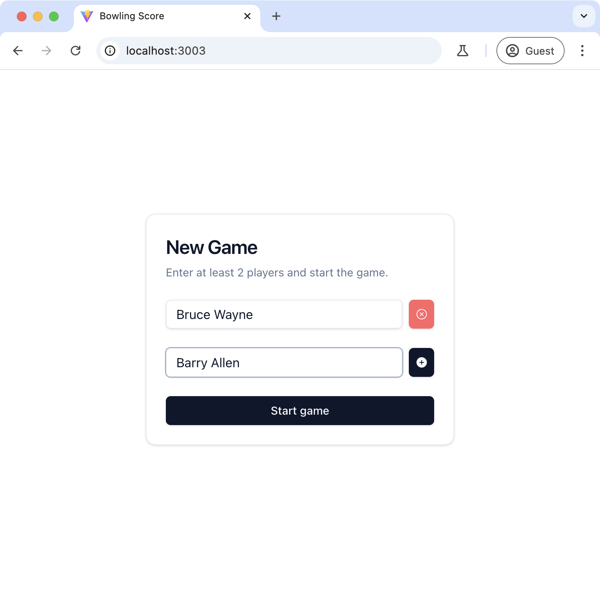
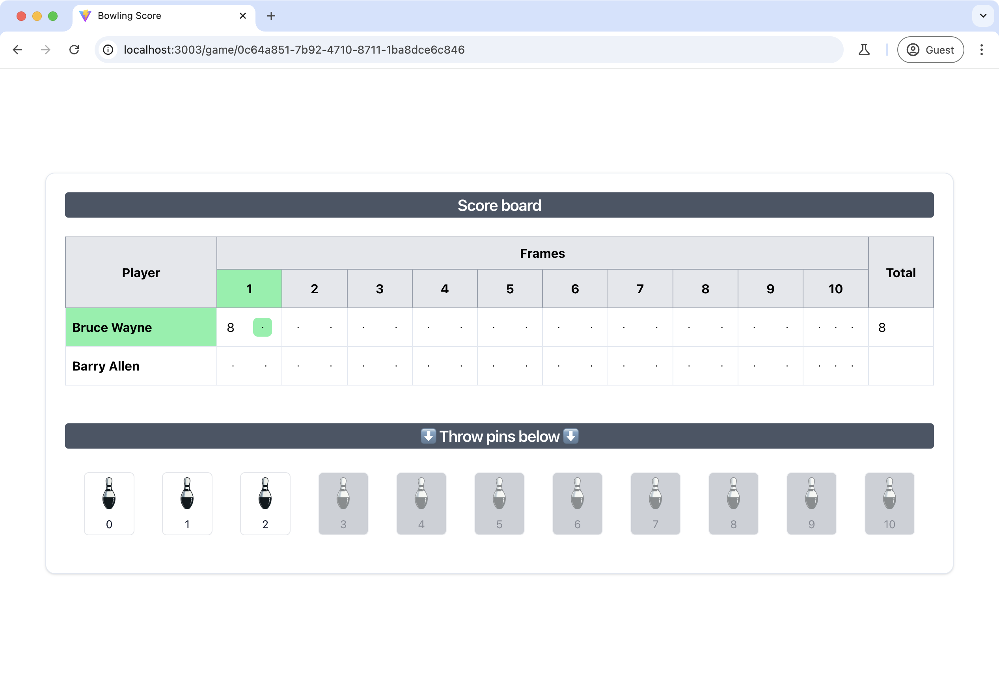
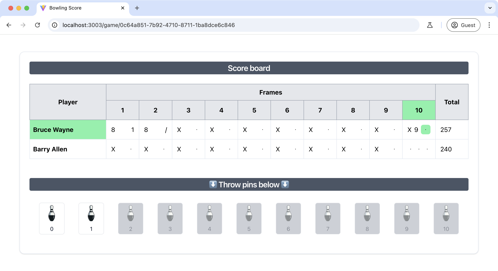
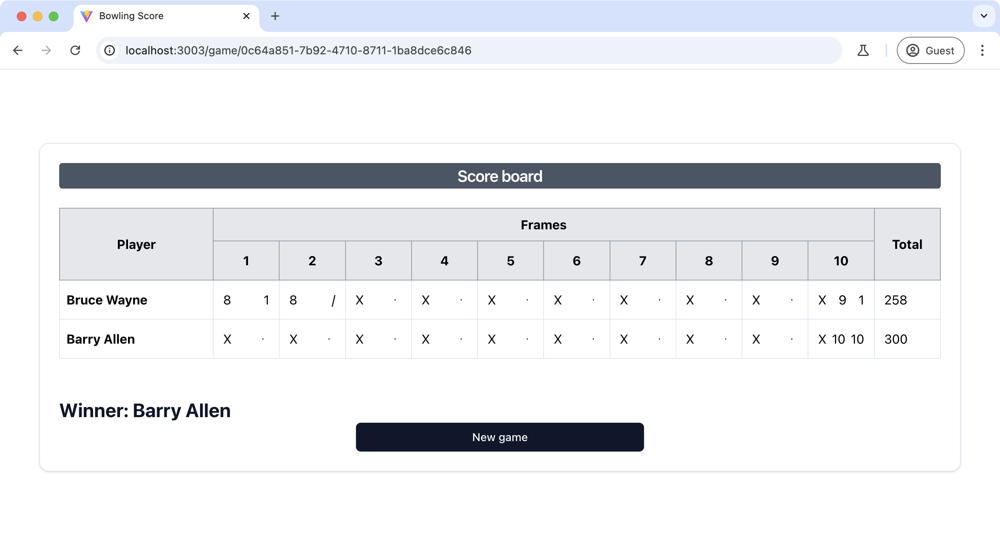
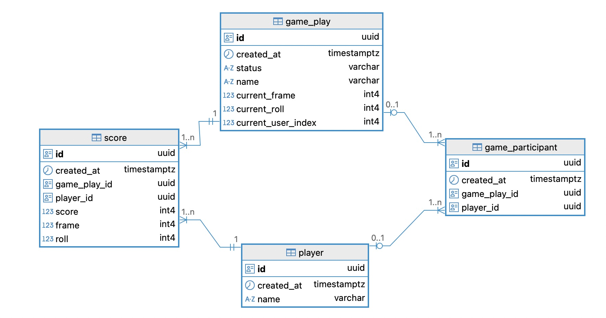

# Bowling Score Board

## Try it locally

```sh
docker compose up
```
Then visit: http://localhost:3003

The following services would be started:

- postgres_db
- flyway
- game-api
- frontend









## Architecture


### Packages
- [game-web](game-web): Frontend
- [game-api](game-api): Backend

### 1. Frontend
- Pure React
- TanStack Query for "state-management"-like
- react-hook-form
- react-router + React.lazy
- Style snippets referenced from `shadcn/ui`
- ESLint v9

### 2. Backend
- Golang
- Project structure: Hexagonal Architecture
- Bun for ORM
- Echo for HTTP router

### 3. Database
- Postgres
- Flyway for migration

Gameplays, players, scores are stored in the database. Users can reload the page while playing.

### DB model




## Testing

Unfortunately, I haven't had much time to write unit, integration, or automation tests. I’ve only done manual testing.
